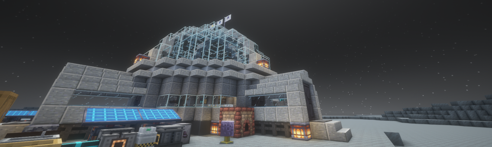

# 🌙 Project Anoxia Lunar Ruins

*Only for the brave who dare to survive on the Moon*

Project Anoxia Lunar Ruins is an ultra-technical Minecraft modpack that pushes your engineering and survival skills to their limits. Build your lunar base, master complex technologies, and survive in one of the most hostile environments imaginable. This pack is NOT for everyone - only for those seeking a true challenge and have the courage to face the unforgiving lunar surface.

**Project Anoxia Lunar Ruins is the official sequel to [The Last Man on Moon](https://www.curseforge.com/minecraft/modpacks/tlmom)**, continuing the lunar survival experience with enhanced technology, deeper progression systems, and even greater challenges.

## ✨ Key Features

- **Advanced Technology Systems**: Master intricate tech trees and complex machinery
- **Realistic Resource Management**: Every resource is precious in the lunar environment
- **Power Engineering Challenges**: Design and maintain sophisticated power networks
- **Automation Necessities**: Automate or die - manual processing won't be enough
- **Atmospheric Survival**: Deal with oxygen, temperature, and radiation management
- **Progressive Tech Tree**: Unlock technologies in a challenging progression system
- **Interconnected Systems**: Create synergies between different mods' mechanics
- **Guided Quest System**: Follow structured missions to navigate through the complex tech progression

## 📚 Quest System

Project Anoxia Lunar Ruins features a comprehensive quest system that guides you through the modpack's progression:

- **Tutorial Quests**: Learn the basics of lunar survival and initial technology setup
- **Progression Chapters**: Structured chapters that follow the technological advancement path
- **Challenge Quests**: Special missions that test your engineering and problem-solving skills
- **Reward System**: Earn valuable resources and unique items by completing quest lines
- **Documentation**: In-game documentation and tips to help you understand complex mechanics

## 🛠️ Main Mods

- **Cooking for Blockheads**: THE MOST ESSENTIAL mod - because even astronauts need gourmet meals on the Moon! Without proper cuisine, your lunar base is doomed to fail!
- **Mekanism**: Advanced machinery, power generation, and processing systems
- **Applied Energistics 2**: Digital storage and complex autocrafting networks
- **Thermal Series**: Resource processing and infrastructure development
- **Ad Astra**: Space travel, oxygen management, and planetary exploration
- **Create**: Mechanical automation, rotational power, and engineering solutions
- **Masterful Machinery**: Custom multi-block machinery and complex production systems
- **Botania**: Nature-based magic, automation, and unique resource generation
- **Magical Crops**: Resource farming and magical agriculture systems
- **Chemistry**: Chemical compounds, reactions, and advanced material processing
- **Supporting Mods**: Carefully selected complementary mods that enhance the technical experience (and your lunar kitchen!)

## 💻 System Requirements

- **Minecraft**: 1.20.x
- **RAM**: Minimum 8GB dedicated (10GB+ recommended)
- **Java**: Java 17 or higher
- **Processor**: Intel Core i7 / AMD Ryzen 7 or better (heavy automation will tax your CPU)
- **Storage**: SSD strongly recommended for faster loading times
- **Graphics**: Dedicated GPU recommended for better performance

## 📥 Installation

1. Download the modpack from one of the links below
2. Install via CurseForge App, Prism Launcher, or other compatible launcher
3. Allocate at least 8GB of RAM to the instance (10GB+ recommended)
4. Launch the game and prepare for the ultimate lunar challenge!

## 🔗 Download

## 🤝 Contribute

Have suggestions or found bugs? Open an issue on our GitHub page or contact me through Discord!

## 📜 License

This modpack is distributed under GNU GPLv3. See the `LICENSE` file for more details.

---

*Created with ❤️ by [NoveIX]*

## ⚠️ Fair Warning

This modpack is designed to be challenging. You will fail. You will need to restart. You will learn from your mistakes. But for those who persevere, the satisfaction of building a thriving lunar colony using some of the most complex technical mods available makes it all worthwhile.

Are you up for the challenge?
