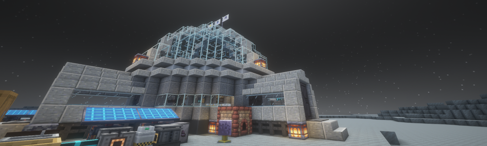

  

---

# 🌙 Project Anoxia Lunar Ruins

Project Anoxia Lunar Ruins is an ultra-technical Minecraft modpack that pushes your engineering and survival skills to their limits. Build your lunar base, master complex technologies, and survive in one of the most hostile environments imaginable.

Project Anoxia Lunar Ruins is the **official sequel** to [The Last Man on Moon](https://www.curseforge.com/minecraft/modpacks/tlmom), continuing the lunar survival experience with enhanced technology, deeper progression systems, and even greater challenges.

## 🚀 Features

- **Lunar Survival**: Explore and survive on the Moon with extreme challenges and resource scarcity.
- **Advanced Technology**: Master mods like Create, Mekanism, and Ad Astra for complex machinery and space travel.
- **Custom Recipes**: Enhanced material processing, compressed blocks, and unique crafting recipes via KubeJS scripts.
- **Deep Progression**: Unlock powerful technologies through intricate questlines and research.
- **Hostile Environment**: Face radiation, low gravity, and alien threats in a true survival experience.

## 📋 Requirements

- **Minecraft Version**: 1.20.1
- **Java Version**: 17 (recommended)
- **Forge Version**: 47.4.10
- **RAM**: At least 8GB recommended for smooth gameplay

## 📦 Installation

1. Download the modpack from [CurseForge](https://www.curseforge.com/minecraft/modpacks/anoxia).
2. Import the modpack and select the appropriate profile.
3. Launch and enjoy!

## 🖥️ Server Setup

To run a server:

1. Download the server files from the [CurseForge](https://www.curseforge.com/minecraft/modpacks/anoxia/files).
2. Run `startserver.bat` (Windows) or `startserver.sh` (Linux/Mac).
3. The script will automatically download and install a local Java 17 runtime inside the pack.
4. (Optional) You can configure the script to use a custom Java installation by editing the script and specifying your preferred Java path.
5. The installer will download necessary files automatically.
6. Configure `server.properties` as needed.
7. Invite friends to join your lunar adventure!

**Note**: Server files are included for easy setup. Check `user_jvm_args.txt` for JVM arguments.

## 🌿 Branches

- [main](https://github.com/NoveIX/Anoxia) - Presentation Branch
- [1.20](https://github.com/NoveIX/Anoxia/tree/1.20) - Development branch of Minecraft version 1.20.1

## 🤝 Contributing

We welcome contributions! Feel free to:

- Report bugs or suggest features via [GitHub Issues](https://github.com/NoveIX/Anoxia/issues).
- Submit pull requests for improvements to scripts or configurations.
- Join our [Discord](https://discord.gg/2bq996c5xF) to discuss ideas.

## 📜 License

This modpack is distributed under GNU GPLv3. See the `LICENSE` file for more details.
*Individual mods retain their original licenses.*

---

*Created with ❤️ by [NoveIX]*
